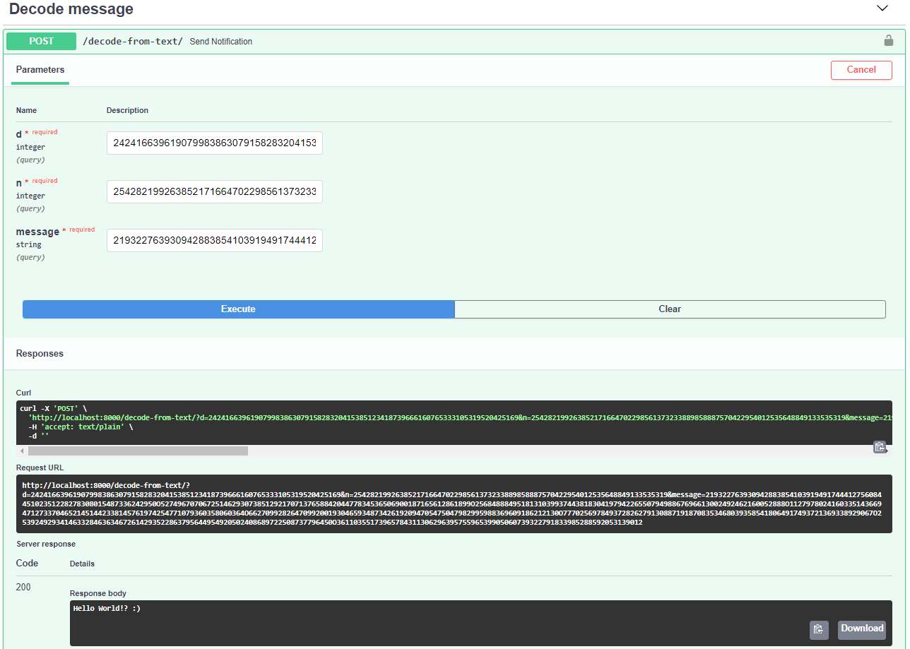

# RSA Algorithm
> Project uses asymmetric cryptographic algorithm RSA in order to encrypt and decrypt a message. It is able to hunt maximum 768-bit long prime numbers out (232 digits) to generate public and private keys.

## Table of contents
* [General info](#general-info)
* [How it works](#How-it-works)
* [Technologies](#technologies)
* [Setup](#setup)
* [Features](#features)
* [Status](#status)
* [Contact](#contact)

## General info
This program uses two tests in order to generate large prime numbers with a high level of probability. The first of them is a low level test that is based on dividing the tested number by all first prime numbers lower than 1000. The second one is Miller–Rabin primality test which is a probabilistic primality test: an algorithm which determines whether a given number is likely to be prime. Next, using the RSA Algorithm and other supporting algorithms, this programs generates public and private keys in order to enccrypt and decrypt messages.

## How it works
1) http://localhost:8000/docs

2) Authorisation

3) Key generation

4) Encoding message:

* encode from text allows to encode a one line message written using ASCII glyphs
    

* encode from file allows to encode a multi line message written using ASCII glyphs and control characters saved in .txt extension

5) Decoding message:

* decode from text allows to paste a enrypted message and decpryt it

* decode from file allows to decode a encrypted message from .txt file

## Technologies
* Python - version 3.8.5
* FastAPI - version 0.63.0

## Setup
1) Download this respository.
2) Install Python (ver. over 3.6) on your local enviroment.
3) Install FastAPI with the command 'pip install fastapi'
4) Install Uvicorn with the command  'pip install uvicorn[standard]'
5) Install python-multipart with the command 'pip install python-multipart'
5) Run the server in your project location with 'uvicorn main:app --reload'
6) Open 'http://localhost:8000/docs' in your browser
7) Authorisation: 
    * Username: _Admim_
    * Password: _12345_

## Features
List of features ready and TODOs for future development

Ready features:
* Generate 768-bit long prime numbers
* Generate public and private keys using the RSA Algorithm
* Encrypt pairs of signs using the RSA keys and ASCII
* Possibility to upload a message to encrypt from _.txt_ file

To-do list:
* Create unit tests in order to testing program
* Create a more user-friendly interface
* Generate larger prime numbers e.g. 1024-bit or 2048-bit long
* Improve scheme of encrypting message

## Status
Project is: _in progress_.

## Contact
* Email: jakub.simon@o2.pl
